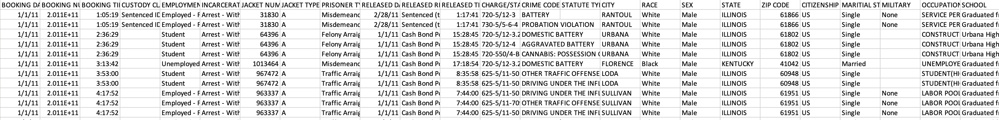
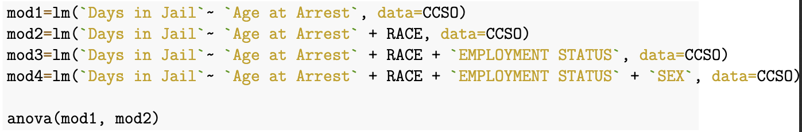
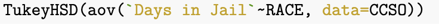

# Project Goals

Goals: "Transcription: Converting from an existing implementation into another one"
\
 - converting this [Dashboard](https://ypatel55.github.io/CS416/index.html) created by me using JavaScript, HTML, and CSS into R
 \
 - conducting deeper analysis with linear regression models, performing F tests, and Tukey test to decide which variables from the data have a relationship with arrest details

Topic: The relationship between a person's characteristics and their arrest details in the CCSO dataset
\
 - modeling the data to determine which variables are significant
 \
 - visualizing the data to display the effect of these variables on the amount of days spent in jail per booking

Takeaway: By cleaning, modeling, visualizing, and summarizing this data, I hope to display trends seen in society regarding inequality with local data. I will explore and exhibit how race and other attributes affect one's arrest details, specifically how people of color generally face different arrest details than white individuals.
 

# Data Source

This project will be using the dataset from the Champaign County Sheriff Office that has data about the demographics of the jail bookings of those who were arrested in the area between the years 2011-2016. We will focus on arrest bookings throughout the years in the town of Champaign, IL.

Data Preview: [CCSO data Preview](https://uofi.app.box.com/s/9elozjsg99bgcb7gb546wlfr3r2gc9b7)
Data Source: [CCSO data link](https://urldefense.com/v3/__https://uofi.box.com/shared/static/9elozjsg99bgcb7gb546wlfr3r2gc9b7.csv__;!!DZ3fjg!qne6EGT2quooBkl5yefW0Q7-9ahvQK16VabWd7V9ijMdaIbnYzNYU_bir-Vz4RLl8a0$)

# Data Cleaning

Data Errors
\
 - Misspellings of Champaign, IL: Used Regex and selective conditions to correct these misspellings as they provide valuable information to the data
 \
 - Missing values: Removed missing values in columns that we focus on
 
Data Filtering 
\
 - Filtered the data set to focus on jail bookings specifically in Champaign, IL so that I can conduct analysis on our local campus town

# Modeling: Linear Regression and F tests

The first step in my project is to model the data and decide which models and variables are significant in predicting the outcome. Specifically, I explore which combination of variables creates the best model in predicting how many days an individual will spend in jail. 

Null Hypothesis: First model is adequate in predicting the response variable
\
Alternative Hypothesis: The additive model is better in predicting the response variable

Using multiple F tests, I compare models with additional variables added in to see which regression model best predicts the days spent in jail. We expect the model with all the variables to be significant as we expect race, age at arrest, sex, and employment status all affect days spent in jail. 

# Modeling: Results

From the analysis of variance table, each P value for the F test between models explains which model is better. In the F test results, the P value for each model comparsions is less than alpha=0.05. This means that we are able to reject the null hypothesis and can say the additive model is better for each model. Overall, the model with all variables is significant and all the included variables are significant in predicting the response of days spent in jail for each booking.

# Modeling: Tukey Test

TukeyHSD measures the significant difference between the attributes in predicting a specific outcome. By using this function, I displayed how each race has a difference in predicting how many days one spends in jail.

Using the function shows us the existence of differences between each race. From the results, it is revealed how the most significant differences are between groups Black-Asian/Pacific Islander, Hispanic-Black, and White-Black. There is a significant difference between Black and each race and we know this as the P value is less than an alpha value of 0.05. From this we can say that the difference supports that a booking of a individual of race Black typically predicts highers days in jail.

# Visualizations

Using the library tidyverse and ggplot functions, I was able to display visualizations for the variables I determined were significant and their effect on the amount of days one spent in jail. These visualizations effectively show the user the relationship between a person's various characteristics and their arrest details.
{width=30%}{width=30%}{width=30%}
{width=30%}{width=30%}{width=30%}

# Analysis and Conslusion
Through cleaning, modeling, visualizing, and summarizing data, my project exhibits the relationship between a person's characteristics and their arrest details. As shown, the variables that are significant in predicting the amount of days one spends in jail include age at arrest, race, sex, and employment status. Being from specific minorities and groups largely changes the circumstances of arrest and society typically follows these same trends as well. By analyzing this issue in our local college campus town, we can see how inequality exists where we live similar to how we see in the news all over the country.

